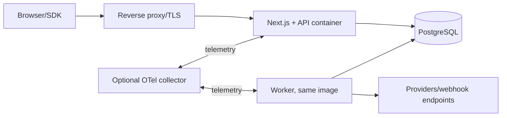
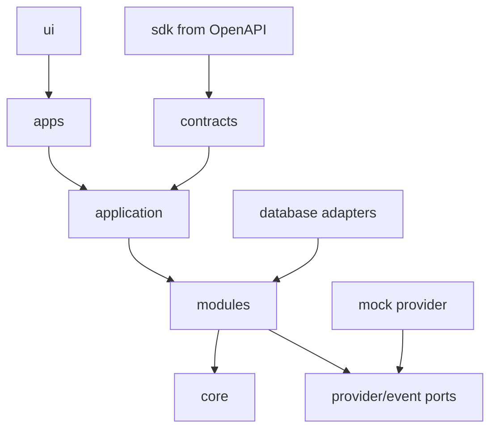
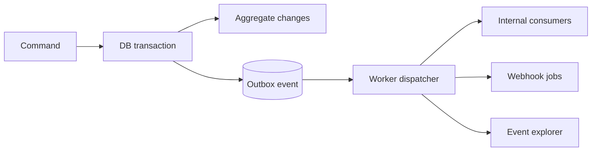

# System architecture and decision log

## Shape

A TypeScript modular monolith has HTTP and worker process modes sharing versioned domain packages. PostgreSQL is source of truth, durable job queue, event outbox, and analytics source in V1. Reference Next.js apps call the public application boundary.

```mermaid
flowchart TB
  subgraph R[Reference applications]
    D[Dashboard] --- S[Storefront] --- C[Hosted checkout] --- Docs[Docs]
  end
  R --> API[REST API / application layer]
  API --> MOD[Commerce | Payments | Operations | Platform modules]
  MOD --> CORE[Money, IDs, policies, state machines]
  MOD --> DB[(PostgreSQL)]
  MOD --> OUT[Transactional outbox]
  W[Worker] --> OUT
  W --> PA[Provider adapter ports]
  PA --> M[Mock provider]
  PA -. later .-> PSP[External providers]
  W --> WH[Public webhooks]
```



Docker Compose runs web, worker, postgres. Worker claims jobs with `FOR UPDATE SKIP LOCKED`. Redis is absent until measurement justifies it.

## Repository

```text
apps/{api,dashboard,storefront,checkout,docs}
packages/{core,application,database,auth,contracts,sdk,events,webhooks,analytics,ui,config,testing}
modules/{organizations,commerce,payments,operations,subscriptions,marketplace,capital}
providers/{contract,mock,conformance}
examples/{node,webhooks}
tooling/{eslint,typescript,scripts}
docker/
```



Dependencies point inward. Core imports no application modules. Cross-module access uses application ports/events, never another module's ORM tables. Adapters depend on ports. Apps never import repositories. CI rejects dependency cycles.

## Stack

- Next.js and TypeScript for reference apps and API composition.
- **Drizzle** over Prisma for transparent SQL, locking, migrations, and PostgreSQL RLS context. Cost: more explicit querying.
- pnpm + Turborepo; Zod at boundaries, database constraints underneath.
- Auth.js with pluggable OIDC and local dev bootstrap.
- Graphile Worker for PostgreSQL-backed durable jobs; domain events use an outbox abstraction.
- Vitest, Playwright, Testcontainers, MSW.
- OpenAPI 3.1, Redocly lint, Scalar docs; generated types plus ergonomic SDK layer.
- OpenTelemetry, Pino, Prometheus-compatible metrics. Sentry optional.
- No general cache; CDN cache only immutable/public catalogue reads with explicit invalidation.

## Event flow



Consumer dedupe key is `(consumer_name,event_id)`. Ordering is per aggregate/version only.

## ADR log

| Decision     | Considered                    | Chosen / why                                 | Tradeoff and revisit                          |
| ------------ | ----------------------------- | -------------------------------------------- | --------------------------------------------- |
| Architecture | Microservices, monolith       | Modular monolith: atomicity/local simplicity | Split only on measured scale/team boundary    |
| API          | REST, GraphQL                 | REST/OpenAPI: predictable resources/SDK      | Add query surface for proven needs            |
| ORM          | Prisma, Drizzle               | Drizzle: SQL and transaction control         | Revisit on maintenance evidence               |
| Events/queue | Kafka, Redis, DB              | PostgreSQL outbox + Graphile Worker          | Broker at sustained throughput/retention need |
| Auth         | Bespoke, hosted, Auth.js/OIDC | Auth.js plus OIDC ports                      | Security hardening required                   |
| License      | MIT, Apache, AGPL             | Apache-2.0: adoption + patent grant          | Revisit if cloud exploitation harms mission   |
| Tenant       | DB/schema/shared              | Shared schema + mandatory org key + RLS      | Dedicated tier only on real need              |
| Finance      | Ledger, operational model     | Provider owns settlement; immutable evidence | Ledger only if product later owns balances    |

Do not hold database transactions across network calls. Persist attempt, call provider asynchronously/safely, then reconcile. Timeouts remain pending/unknown; never infer failure.
