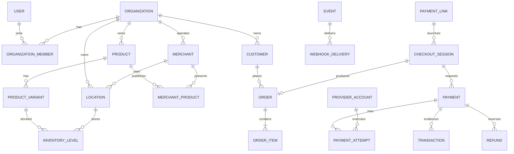
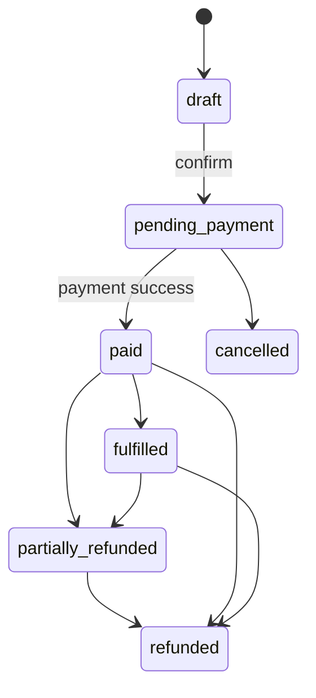
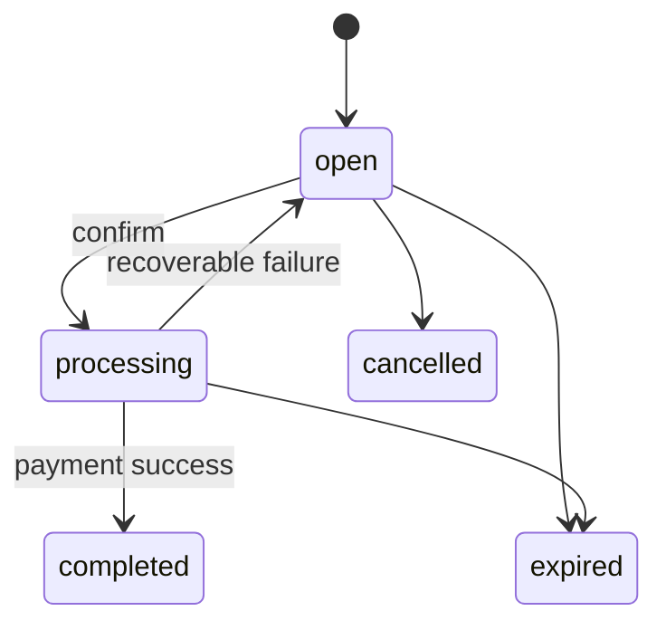
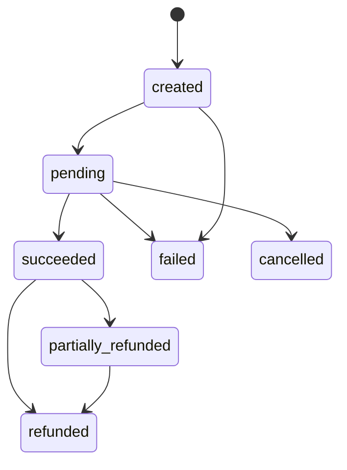
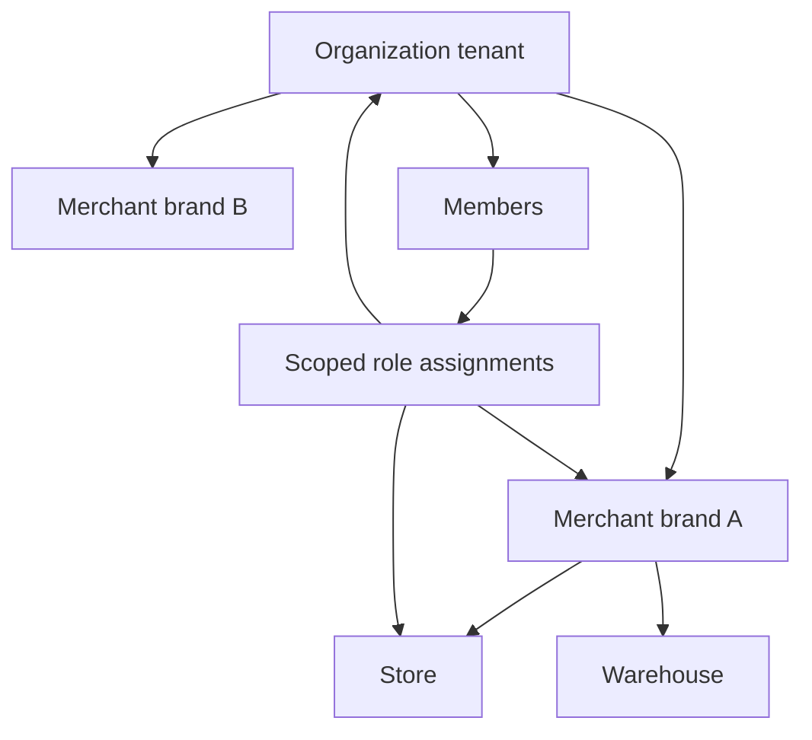

# Domain model

## Ownership

- Organization is the security, provider-configuration, and data tenant.
- Merchant is a brand/trading profile inside an organization. One organization may operate many; it is not a tenant.
- Location is an operational node owned by organization and assigned to a merchant where applicable.
- User is global identity; OrganizationMember joins a user to one organization. Role assignments may be organization-, merchant-, or location-scoped.
- Organization owns canonical customers/products. Merchant/channel associations control presentation.
- Every tenant table carries organization_id directly, including child rows, enabling auditable policies and composite ownership constraints.

Add `MerchantProduct`, `InventoryLevel`, `InventoryMovement`, `IdempotencyRecord`, `ProviderEvent`, `OutboxMessage`, `RoleAssignment`, `PaymentMethodReference` (token/reference only), and `WebhookSubscription`. Remove standalone Employee: it is an OrganizationMember with staff profile and scoped roles. Provider is code registry data; ProviderAccount is tenant-owned.

## Distinctions

- CheckoutSession is an expiring buyer intent/quote; line snapshots freeze before confirmation.
- Order is the commercial obligation and fulfilment record; it may exist without checkout.
- Payment requests collection of one amount/currency; it can have sequential attempts.
- PaymentAttempt is one provider-account execution.
- Transaction is immutable normalized financial evidence, not an account ledger or mutable state.
- Refund is a reversal command aggregate; its transaction records resulting evidence.
- Payout is a future outbound provider instruction and is not exposed in V1.

## State machines

Store fulfilment and financial status separately; combined labels are derived. Paid never returns to pending.

Completed/expired/cancelled checkout cannot reopen.

Succeeded never becomes failed. Timeout stays pending until reconciliation. Refund: `created -> pending -> succeeded|failed`. Webhook delivery: `queued -> delivering -> succeeded` or `retry_scheduled -> delivering`, ending `failed` after threshold; replay creates a linked new delivery.

## Invariants

- Currency cannot change after confirmation; item snapshots reconcile exactly to totals.
- Succeeded refunds cannot exceed succeeded payment; concurrent refunds lock the aggregate.
- One active attempt per payment in V1.
- Inventory movements append only; level updates atomically and cannot go negative.
- Provider references are unique within provider account/environment.
- Environment is immutable and participates in routing/idempotency uniqueness.

