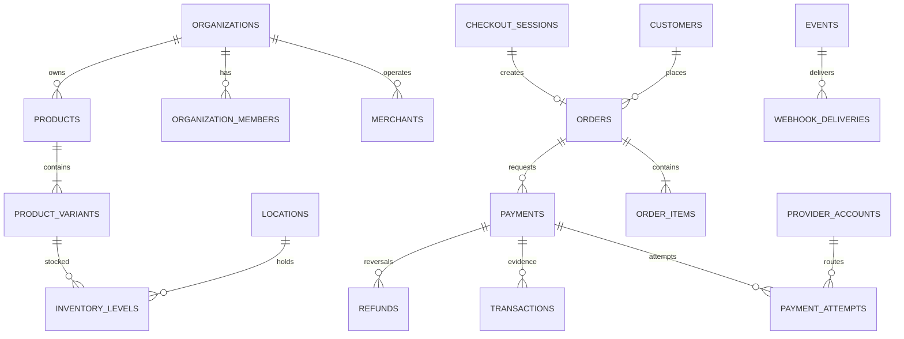

# Database design

PostgreSQL 16 is authoritative. UUIDv7 primary keys, timestamptz, snake case, explicit foreign keys/checks, and reviewed migrations are mandatory. Tenant rows carry non-null organization_id; composite foreign keys on organization_id plus ID prevent cross-tenant references. RLS is defense in depth: request transactions set the organization context; workers also set and validate tenant context.

## Table specifications

All mutable tables have created_at/updated_at; immutable append tables have created_at only. “Org” means direct non-null organization ownership.

| Table                                | Purpose and important fields                                                                     | Constraints/indexes                                              | Delete                                     |
| ------------------------------------ | ------------------------------------------------------------------------------------------------ | ---------------------------------------------------------------- | ------------------------------------------ |
| organizations                        | tenant; id, name, slug, status, default_currency, timezone                                       | unique slug; status check                                        | close; never hard-delete with finance data |
| users                                | global identity; email, auth_subject                                                             | unique normalized email/subject                                  | deactivate/anonymize                       |
| organization_members                 | Org, user, status, staff_profile                                                                 | unique (org,user); user/status indexes                           | deactivate                                 |
| roles, permissions, role_permissions | authorization catalogue                                                                          | unique keys                                                      | seeded/immutable V1                        |
| role_assignments                     | Org, member, role, scope_type/id                                                                 | unique assignment; scope ownership                               | hard delete + audit                        |
| merchants                            | Org, names, slug, status                                                                         | unique (org,slug); status index                                  | archive                                    |
| locations                            | Org, merchant, name, type, timezone, status                                                      | unique (org,merchant,name)                                       | archive                                    |
| customers                            | Org, name, email, phone, external_ref, metadata                                                  | partial unique external_ref; email/created indexes               | anonymize                                  |
| products                             | Org, name, slug, description, status, metadata                                                   | unique (org,slug); status index                                  | archive                                    |
| product_variants                     | Org, product, sku, title, unit_amount bigint, currency                                           | unique (org,sku); amount nonnegative                             | archive                                    |
| merchant_products                    | Org, merchant, product, visibility                                                               | unique triple                                                    | hard delete                                |
| inventory_levels                     | Org, variant, location, on_hand bigint, version                                                  | unique triple; nonnegative                                       | retain if referenced                       |
| inventory_movements                  | immutable Org, level, delta, reason, order, actor                                                | level/time and order indexes                                     | never                                      |
| orders                               | Org, merchant/location/customer, number, financial/fulfilment status, currency and totals        | unique (org,number); amount checks; status/time/location indexes | never delete paid                          |
| order_items                          | Org, order, optional variant, immutable name/SKU/price snapshot, quantity, total                 | quantity positive, exact totals                                  | only with unpaid draft                     |
| checkout_sessions                    | Org, merchant/customer/link/order, status, totals, URLs, expiry, version                         | status/expiry and customer indexes; optional client ref unique   | retain terminal                            |
| checkout_line_items                  | Org, session, variant, price/name snapshot, quantity                                             | session index                                                    | follows nonterminal retention              |
| payments                             | Org, order/session, amount/currency, status, refunded_amount, environment                        | amount positive; order/status/time indexes                       | never                                      |
| payment_attempts                     | Org, payment, provider account, status, provider_ref, error fields                               | unique provider ref in account/environment; one active/payment   | never                                      |
| transactions                         | immutable Org, payment/refund, kind, amount/currency, provider evidence, occurred_at             | unique evidence; payment/time/kind indexes                       | never                                      |
| refunds                              | Org, payment, amount/currency, status, reason                                                    | positive; payment/status indexes                                 | never                                      |
| payment_links                        | Org, merchant, slug, kind, config, status, expiry, usage limit/count                             | unique public slug; limit checks                                 | archive                                    |
| provider_accounts                    | Org, provider key, environment, encrypted credentials, key version, capabilities, status         | unique org/provider/env/label                                    | disable; crypto-shred by policy            |
| provider_events                      | immutable Org nullable until resolved, account, external ID, digests, encrypted raw body, status | unique account/external ID; received/status indexes              | purge body after retention                 |
| events                               | immutable Org, type/version, aggregate type/id/version, payload, occurred_at                     | aggregate version uniqueness; org/type/time indexes              | retention policy only                      |
| outbox_messages                      | event, topic, state, available, attempts, lease                                                  | unique event/topic; state/available index                        | purge after retention                      |
| webhook_endpoints                    | Org, URL, encrypted current/next secrets, status, failures                                       | URL policy; status index                                         | disable/soft-delete                        |
| webhook_subscriptions                | Org, endpoint, event pattern                                                                     | unique endpoint/pattern                                          | hard delete + audit                        |
| webhook_deliveries                   | Org, event, endpoint, generation, status, attempts, next attempt, response digest                | unique event/endpoint/generation; scheduler indexes              | retain metadata                            |
| api_keys                             | Org, prefix, secret hash, scopes, environment, expiry/status                                     | unique prefix; no stored secret                                  | revoke/retain audit                        |
| idempotency_records                  | Org, key hash, operation, principal/env, request hash, stored response, lock/expiry              | unique scoped key; expiry index                                  | TTL purge                                  |
| audit_logs                           | immutable Org, actor, action, target, request, redacted diffs, IP/UA                             | org/time, actor, target indexes                                  | append-only retention                      |

Future invoices, plans, subscriptions, listings, capital profiles, payouts, and terminals are migrated only with their modules.

## Status and retention

Checked text values ease safe additions. Order financial: unpaid, paid, partially_refunded, refunded; fulfilment: unfulfilled, fulfilled, cancelled. Checkout: open, processing, completed, expired, cancelled. Payment: created, pending, succeeded, failed, cancelled, partially_refunded, refunded. Attempt: created, submitted, pending, succeeded, failed, unknown. Refund: created, pending, succeeded, failed. Delivery: queued, delivering, retry_scheduled, succeeded, failed, disabled.

PII has configurable retention/anonymization. Financial evidence, audit, and event records are not product-deletable. Erasure anonymizes customer identity while preserving necessary non-identifying evidence.
