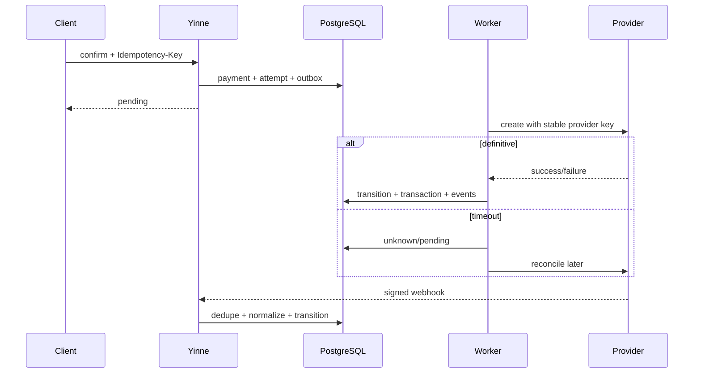

# Provider architecture

Adapters implement narrow capability ports, not one giant interface.

```ts
type Capability =
  | "payment.create"
  | "payment.retrieve"
  | "payment.refund"
  | "checkout.redirect"
  | "webhook.verify"
  | "payout.create"
  | "virtual_account.create"
  | "recurring.charge";

interface ProviderAdapter {
  descriptor(): { key: string; version: string; capabilities: Capability[] };
  payments?: PaymentCapability;
  refunds?: RefundCapability;
  checkout?: HostedCheckoutCapability;
  webhooks: WebhookCapability;
  payouts?: PayoutCapability;
  recurring?: RecurringCapability;
}
```

Each operation returns normalized status (pending, succeeded, failed, unknown), stable provider reference, optional next action (redirect, sdk_token, none), normalized error, and restricted provider_data. Core stores namespaced provider metadata but cannot branch on it.

## Discovery, errors, accounts

Errors normalize to authentication, invalid_request, unsupported, declined, rate_limited, unavailable, timeout, conflict, or unknown, with retryable, safe message, provider request ID, and optional retry-after. Raw errors/secrets never leave the adapter boundary. Account endpoints return declared and credential-verified capabilities; missing capability fails before effects.

Organizations may configure multiple accounts. Credentials use envelope encryption through a KMS/master-key port, versioning, redaction, and just-in-time worker decryption. Test/live accounts, keys, references, events, and idempotency namespaces are isolated. Production rejects mock as live.

## Routing and retries

Explicit compatible account wins. Otherwise filter environment, enabled status, capability, currency/country, merchant/location policy, then priority. V1 allows one default match and errors on ambiguity. Never automatically fail over after submission because it may double-charge. A pre-submission transport retry uses the same provider idempotency key. Cross-provider retry is a new explicit attempt.

Yinne derives the provider idempotency key from attempt ID. Retry bounded transport failures with jitter only where adapter declares idempotency. Timeout becomes unknown/pending and reconciliation retrieves status; it is not guessed failed.

## Webhooks and metadata

Adapter verifies raw bytes, timestamp, and secret before parsing, then returns stable external ID, normalized kind/object reference/time, and safe data. Duplicate external IDs are acknowledged once. Provider metadata remains encrypted/restricted and versioned by provider namespace.

## Mock provider

Mock supports deterministic success, decline, pending, timeout-then-success, full/partial refund, failed refund, payout success/failure, renewal, webhook, and virtual-account-like collection. Payout/renewal/VA are conformance-only until their modules ship.

Scenario tokens are test-only: success; failure:declined; pending:then_success@2s; timeout:then_success; refund_success; refund_failure. Deterministic provider references derive from attempt ID and scripts use a virtual clock. Avoid a global “next result”; if UI offers it, scope by test-run ID and consume once.

## Conformance

Provider contributions must test amounts/currencies, idempotency, duplicate/out-of-order webhooks, unknown timeouts, error normalization, credential redaction, retry rules, and missing capabilities. They document supported regions/currencies, API version policy, webhook setup, sandbox, maintainers, and scrubbed fixtures.


