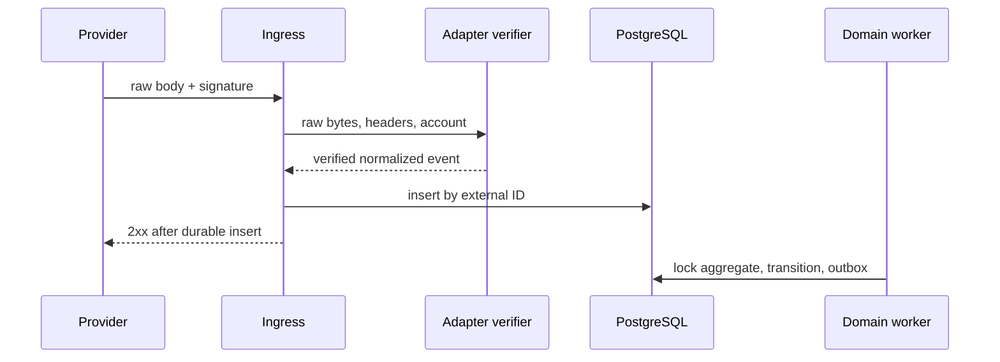
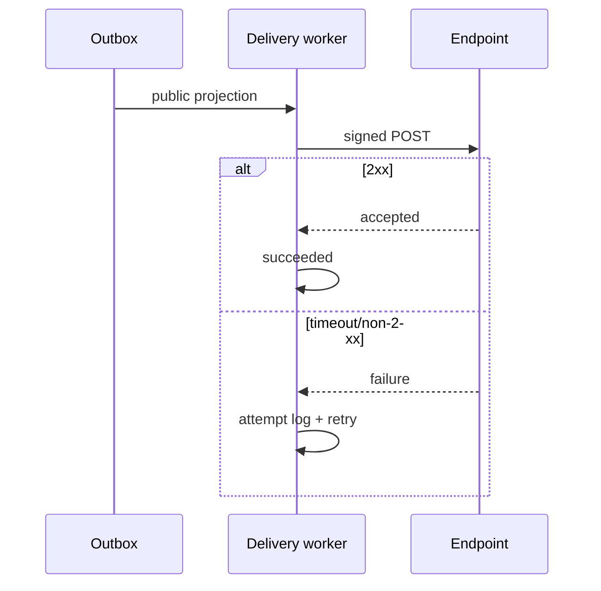

# Webhook architecture

## Provider to Yinne

Ingress preserves raw bytes, limits body/type, identifies account via non-secret route token, verifies signature/timestamp (default ±5m), then parses. Store encrypted raw body with retention plus digests, adapter version, and outcome. Same external ID/digest returns 2xx without effects; differing digest is quarantined. Unknown events are retained/acknowledged. Processing retries internally.

## Yinne to developer

Headers include Yinne-Event-Id, Yinne-Delivery-Id, Yinne-Timestamp, and Yinne-Signature with v1 HMAC-SHA256 over timestamp, period, raw body. Consumers use five-minute tolerance and dedupe event ID.

Secrets are 32 random bytes, displayed once and encrypted. Rotation overlaps current/next for 24h; both signatures are sent and rotation is audited.

- Connect 5s/total 15s; no redirects.
- Retry network errors, 408/425/429/5xx with full jitter around 1m, 5m, 30m, 2h, 8h, 24h (seven total attempts); honor bounded Retry-After.
- Other 4xx are terminal.
- Record timing, status, latency, error class, and redacted/truncated response.
- Failure threshold pauses endpoint and notifies operator. Manual verification/reactivation is required.
- Replay is permissioned/rate-limited and creates a new delivery ID/generation with the same event/body.
- SSRF defenses reject loopback/link-local/private/metadata addresses unless explicit self-host allowlist, validate DNS and pinned connection IP, disallow redirects/unsafe ports.
- Payload has API version and event version. Breaking changes get new versions/migration window.

Acceptance: duplicates yield one transition; invalid signature never parses; retries never regenerate source event; secrets/PII do not enter logs.
