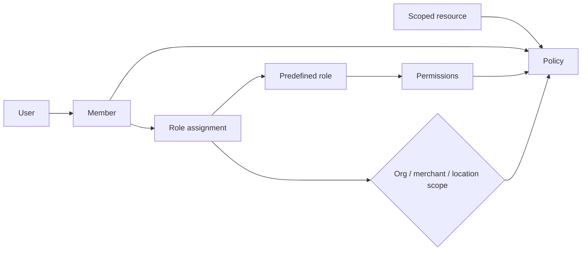

# RBAC and tenant authorization

A User joins an organization through OrganizationMember. RoleAssignment binds a predefined role to organization, merchant, or location scope. Organization scope inherits downward; merchant covers its locations/resources; location covers explicitly attributed resources. Permissions add; no explicit deny in V1. Owner is protected and transfer requires recent authentication.

API keys are service principals with explicit organization/environment scopes, no implicit role.

| Permission                | Owner | Admin |   Finance |       Manager |       Staff |  Analyst | Developer |
| ------------------------- | ----: | ----: | --------: | ------------: | ----------: | -------: | --------: |
| View organization         |     ✓ |     ✓ |         ✓ |        scoped |      scoped |        ✓ |         ✓ |
| Edit organization         |     ✓ |     ✓ |         — |             — |           — |        — |         — |
| Manage team               |     ✓ |     ✓ |         — |  scoped staff |           — |        — |         — |
| Manage API keys           |     ✓ |     ✓ |         — |             — |           — |        — |         ✓ |
| Manage providers          |     ✓ |     ✓ |         ✓ |             — |           — |        — |         ✓ |
| View payments             |     ✓ |     ✓ |         ✓ |        scoped |      scoped |        ✓ |    scoped |
| Create refunds            |     ✓ |     ✓ |         ✓ | scoped/capped |           — |        — |         — |
| View payouts              |     ✓ |     ✓ |         ✓ |             — |           — |        ✓ |         — |
| Manage products           |     ✓ |     ✓ |         — |        scoped |   edit only |        — |         — |
| Manage inventory          |     ✓ |     ✓ |         — |        scoped |      scoped |        — |         — |
| Manage orders             |     ✓ |     ✓ | financial |        scoped |      scoped |        — |         — |
| Manage customers          |     ✓ |     ✓ |      view |        scoped | limited PII |        — |         — |
| Manage subscriptions      |     ✓ |     ✓ |         ✓ |        scoped |           — |     view |         — |
| View analytics            |     ✓ |     ✓ |         ✓ |        scoped |           — |        ✓ |    scoped |
| Manage locations          |     ✓ |     ✓ |         — | assigned edit |           — |        — |         — |
| View capital intelligence |     ✓ |     ✓ |         ✓ |             — |           — |        ✓ |         — |
| Manage webhooks           |     ✓ |     ✓ |         — |             — |           — |        — |         ✓ |
| View developer logs       |     ✓ |     ✓ |         — |             — |           — | redacted |         ✓ |

Granular keys split read/write/publish/refund/replay/PII. Middleware authenticates; application policy resolves scope; repositories require TenantContext and organization predicates; RLS is final defense. Foreign IDs return 404. Counts, exports, events, logs, expansions, and analytics share scope filters. Actors cannot grant above their own permission/scope.

V1 exposes predefined roles only. Tables support custom roles later, but endpoints wait for privilege-escalation UX and migration semantics. Tests cover every route/role/scope and session invalidation after role changes.
