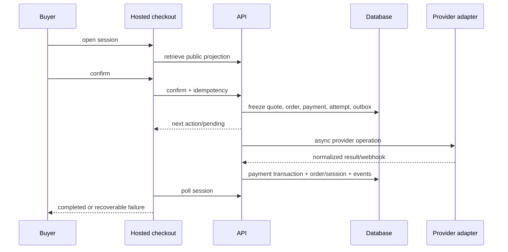

# Checkout specification

CheckoutSession is an expiring buyer intent/quote; Order is the commercial record; Payment is collection state. They are distinct and linked.

## V1 session

Inputs: merchant, optional location/customer/payment_link, line items or allowed flexible amount, currency, metadata, success/cancel HTTPS URLs, customer capture requirements, and optional client reference. Server snapshots product/variant names, unit amounts, quantities, discounts (zero V1), tax/shipping fields (explicit zero or supplied external breakdown), and total. Default expiry 30 minutes, configurable 5 minutes–24 hours.

Anonymous buyers are supported; customer can be created/attached after validated capture. Metadata is namespaced, size-limited, non-sensitive. Success URL placeholder receives opaque session ID; it is not proof of payment.

Legal states are defined in domain model. Confirmation is single-writer/versioned. A recoverable failed attempt may return processing to open and allow another explicit attempt. Expiry during a provider-unknown attempt does not cancel the payment; reconciliation may still succeed and must apply the order while flagging late completion.

## Hosted/embedded

Hosted checkout is REAL IN V1. Embedding is planned as redirect/new-window first; iframe requires frame-ancestor allowlist, postMessage origin protocol, sizing, CSP, and cookie review. Checkout never collects PAN/CVV; adapter next_action redirects to provider-hosted/tokenized UI. Tax, discount, and delivery fields are architecture-ready; V1 supports informational delivery address and zero/manual supplied tax only.

## Acceptance: payment success

Provider result is normalized; transition is legal; duplicate events do not duplicate transaction/order/stock; one charge transaction exists; order becomes paid; inventory movement is atomic; session completes; domain/public events queue; audit/evidence remain; original request retry returns the same payment. Failure preserves a retry path and cannot mark order paid.
