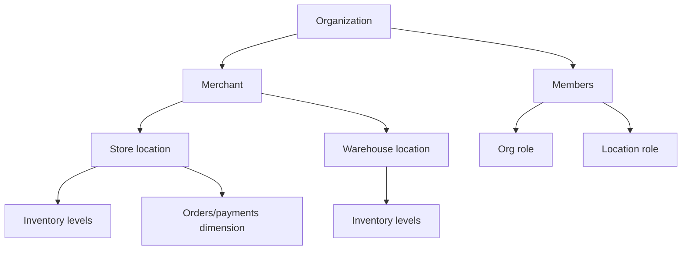

# Multi-location operations

Location is the primitive for store, restaurant, office, branch, warehouse, pop-up, or agent location. It belongs to organization and optionally a merchant; no recursive hierarchy in V1.1. Region/group tags can provide reporting later.

V1 has default location, location on order/payment/inventory, scoped authorization, and filterable metrics. V1.1 adds location CRUD UX, staff assignment, transfers, comparisons, and operating status/hours. Employee remains member plus staff profile. Terminals are planned provider-linked devices with external reference/capabilities/status; they never become payment providers themselves.

An order has fulfilment location; payment inherits analytical location snapshot and cannot be reassigned after success without audited correction event. Inventory is per variant/location. Organization analytics is a scoped union; location analytics filters the immutable location dimension and respects staff scope.

Acceptance: a scoped manager sees only assigned resources and aggregates; transfers are paired append-only movements in one transaction; location archive is blocked or remapped for active work, while history remains; timezone is used for local reporting boundaries but stored timestamps stay UTC.
