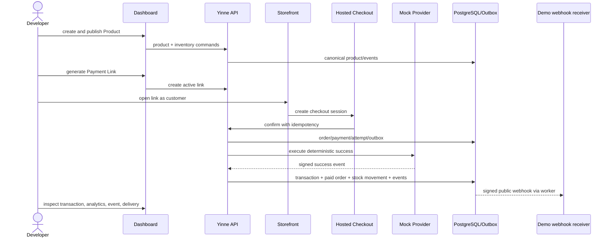

# Acme Coffee demo specification

The deterministic seed demonstrates breadth without hand-maintained bulk data. A seeded generator uses a fixed RNG seed and relative six-month clock; fixtures can pin a reference date for snapshots.

## Seed

- Organization “Acme Coffee,” one merchant, four Lagos locations: Ikeja flagship, Lekki café, Yaba kiosk, Surulere warehouse.
- 12 members across Owner, Admin, Finance, Manager, Staff, Analyst, Developer with at least two location-scoped examples.
- 24 products / about 64 variants across coffee, tea, pastries, brewing gear, and subscriptions-preview tags. Enough for filtering/inventory without noise.
- Inventory levels at relevant locations and append-only initial movements.
- 180 customers (including repeat, one anonymized, and guest orders).
- About 900 orders, payments, attempts, and transactions over six months with weekly seasonality, failures/pending reconciliations, and partial/full mock refunds.
- 8 active/expired/limited payment links; webhook endpoint to local catcher; API keys with distinct scopes.
- Invoices/subscriptions are not active V1 resources. Docs may show clearly labeled planned fixtures only; database seed must not imply working modules.

Amounts are realistic NGN minor units and all totals reconcile. Dates span DST-neutral Lagos but analytics tests separately cover DST zones. PII uses reserved example domains/numbers.

## Golden path

## Demo script and assertions

1. Clean bootstrap shows setup checklist and TEST MODE.
2. Create “Limited Roast” with two variants and add stock to Ikeja.
3. Publish to store; create product payment link.
4. Anonymous browser buys one with mock success.
5. Dashboard shows exactly one paid order/payment/charge, decremented stock, refreshed metrics, domain events, and successful delivery.
6. Repeat confirm and provider webhook: counts remain one.
7. Run decline and timeout-then-success variants; states/explanations converge.
8. Partial refund shows refund transaction and net metric adjustment.

Seed command is idempotent by dataset version and refuses live environment. Acceptance checks canonical totals, foreign keys, role visibility, stable scenario IDs, and no real-looking personal data.
